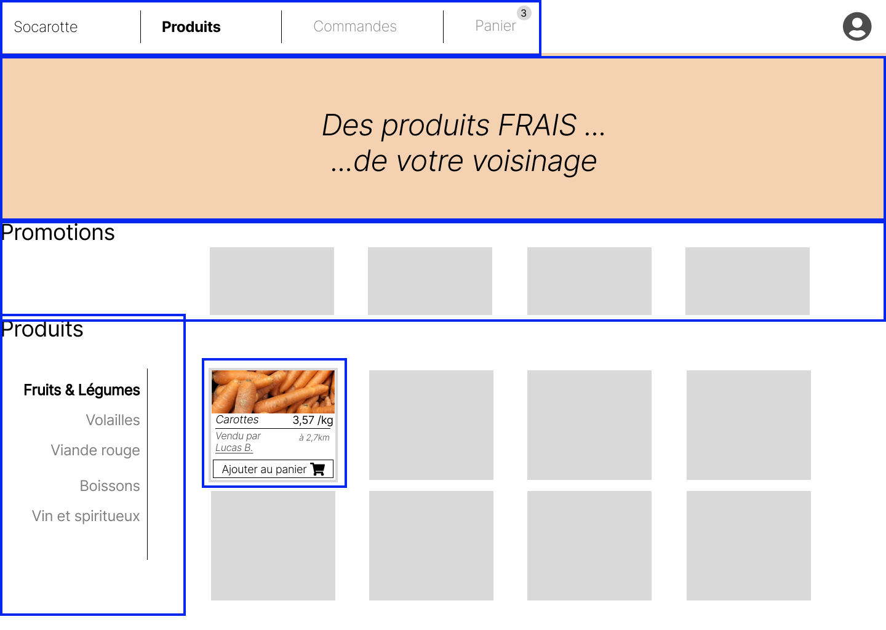
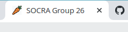

# Responsive Frontend Workshop

This workshop is made for students of EPITA - SIGL 2024.

The aim of the workshop is to implement a responsive user interface (UI) for Socarotte.
To implement it, we will use:

- HTML and CSS only (or SASS/SCSS)
- [NodeJS](https://nodejs.org/en/about/): to be able to use dependencies (other developper's code).

## Step 0: Tools

### IDE

We strongly encourage you to use [Visual Studio Code](https://code.visualstudio.com) for your frontend project.
It's totally free and open source.

You don't have to install any extra plugins for this workshop.

### Install NodeJS

You need to install NodeJS (a.k.a `node`) on your local machine.

Because NodeJS is a tool that evolves fast and has multiple versions, we will use a versionning tool to help us using multiple versions, depending on the project we're working on: [NVM](https://github.com/nvm-sh/nvm) (Node Version Manager)

To install `nvm`, follow instructions in the README of the project: https://github.com/nvm-sh/nvm#installing-and-updating

Once `nvm` is install:

- Create a file `.nvmrc` with `v19` inside
- Install node v19 using `nvm`: `nvm install v19`

Then, everytime you work on your project, you can type `nvm use` command, and it will switch you to the version inside the `.nvmrc` file.

You can verify if everything is fine by checking node version: `node -v`
and it should output version 19.

## Step 1: Create **YOUR** Socarotte

For this Step, you can refer to the frontend-template we've created:
[SOCRA-EPITA-SIGL-2024/frontend-template (main)](https://github.com/SOCRA-EPITA-SIGL-2024/frontend-template)

### Create your HTML view

Create only with HTML 5 and CSS 3 **your** "Produits" view of Socarotte.

You **do not** have to respect the same layout as our model nor the following screenshot, but we insist on having the following elements (again you can put them wherever you feel like on the page):

- Keep your html `<title>` to `Socra Group XX` (replacing XX by your group number)
- Main navigation bar with "Produits", "Commandes" and "Panier"
- A banner with whatever images / text you feel like putting
- A "Promotions" lane where you could see some products on discount. A discount has:
  - a name
  - a price
  - an amount of the discount
  - the price discounted
- A product navigation with "Fruit & Légume", "Volaille", "Viande Rouge", "Boissons", "Vin et spiritueux"
- A product card with:
  - an image of the product
  - a product name
  - a price per kg
  - a description of who is selling and how far frPromotionom our current location
  - a button to add the product to basket



Make it yours!

> Important: it is **only static**. You only create a view where navigation is not active. You only create the view for "Produits"

### Add favicon

In order to have a nice logo on your browser tab when running Socarotte, feel free to download this [nice carrot icon](https://raw.githubusercontent.com/SOCRA-EPITA-SIGL-2024/frontend-template/main/public/favicon.ico).



You can of course build your own.

Once downloaded or created, simply add it to under `public/favicon.ico` in your repository. `http-server` will serve it and your browser should render it.

## Step 2: Annotate your HTML tags

All workshop are corrected automatically. For this to be possible, you will need to add `socra="..."` tags to some of the elements of your page.

For instance, add the following `socra="banner"` to your element that shows the banner:

```html
<div class="banner" socra="banner">...</div>
```

Here are all the tag you **must** add:

- on Socarotte's banner      ```socra="banner"```
- on the main navigation     ```socra="main-navigation"```
- on the product navigation  ```socra="product-navigation```
- on your product card(s)    ```socra="product-card"```

## Challenge: Make me responsive

Make your version of Socarotte responsive by adding `@media` queries for the following sizes:

- `@media (max-width: 460px) { ... }`: except menus, all elements are displayed in one column ("Promotions"'s items and "Produits")
- `@media (max-width: 768px) { ... }`: the banner is no longer displayed
- `@media (min-width: 1200px) { ... }`: increase the font-size (you will decide the best ratio)

> Important: do **NOT** forget to add the following metadata in the head of your HTML document:

```xml
<meta name="viewport" content="width=device-width, initial-scale=1.0">
```
